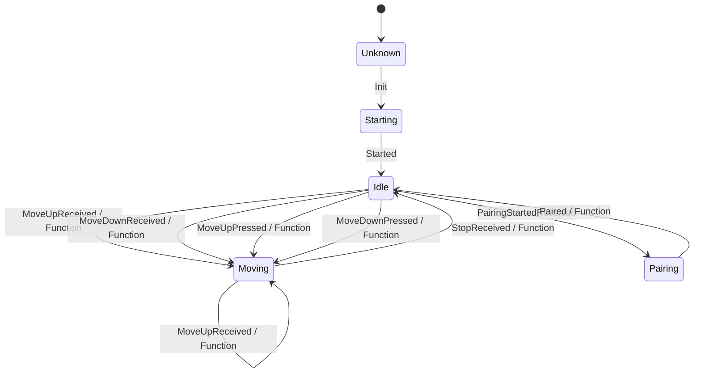

# schellenberg-usb

The aim is to control a Schellenberg belt winder with the Schellenberg RF-Stick. UI is only a REST interface, which can be easily integrated into any third party system (e.g.: Home Assistant). 
The application that communicates directly with the USB RF Stick was developed in C# .NET 8.0. The Nuget [LibUsbDotNet](https://libusbdotnet.sourceforge.net/V2/Index.html) was used for USB communication. This ensures that the solution can be run platform-independently.
The solution was developed in a Windows environment and will ultimately run dockerized on a Raspberry PI (Linux).

The following HW components were used and tested for the development:
- Schellenberg Rollodrive 75 premium (DE 22576)
- Schellenberg radio stick (DE 21009)

The development was only possible thanks to the friendly support of [@LoPablo](https://github.com/LoPablo) and [@Hypfer](https://github.com/Hypfer). Their research into the protocol is the base on which I was able to build this solution (see [schellenberg-qivicon-usb](https://github.com/Hypfer/schellenberg-qivicon-usb)).

Even though the basic functionalities are currently implemented, this project is still under development. I am grateful for any constructive feedback.

## State Machine definition overview 



## API

|REST call | Description |
|--|--|
|GET http://<hostip>:5080/schellenberg/ | Get status info, response is a json <br> <pre> { <br> &emsp; "version": "0.1.0",<br>  &emsp; "lastUpdate": "2025-01-31T15:21:26.363619+00:00",<br> &emsp; "name": "Schellenberg Rollodrive Premium",<br> &emsp; "message": "usbdev1.4",<br> &emsp; "fsm_state": "Idle"<br> }</pre> |
|POST http://<hostip>:5080/schellenberg/pair | Pair the cover drive with the RF Usb stick, under construction (payload should be the unique device ID) |
|GET http://<hostip>:5080/schellenberg/up | Drive the cover up, response is a updated json |
|GET http://<hostip>:5080/schellenberg/stop | Stop the cover driving, response is a updated json |
|GET http://<hostip>:5080/schellenberg/down | Drive the cover down, response is a updated json |


## Docker image for RaspberryPI

https://hub.docker.com/repository/docker/atilladocker/schellenberg-web2rf-api

# Running the solution

## Linux as runtime environment

The following Linux distribution is installed on the Raspberry Raspberry Pi 3 Model B Rev 1.2 with docker/docker compose:
```
PRETTY_NAME="Debian GNU/Linux 11 (bullseye)"
NAME="Debian GNU/Linux"
VERSION_ID="11"
VERSION="11 (bullseye)"
VERSION_CODENAME=bullseye
ID=debian
HOME_URL="https://www.debian.org/"
SUPPORT_URL="https://www.debian.org/support"
BUG_REPORT_URL="https://bugs.debian.org/"
```

### USB driver challenge under linux

Check detailed USB info:

```
lsusb

or

sudo usb-devices | grep -A 5 "16c0"
```

In the response you can see the loaded driver. We had the CDC device with VID/PID 16c0:05e1 attached. For this type of device, the Linux kernel typically loads the 'cdc_acm' driver automatically, which is likely causing "Resource busy" error. If the cdc_acm driver is definitely attached to your device on your interfaces try a aggressive approach to prevent cdc_acm from claiming the device:

Create a blacklist file to prevent cdc_acm from loading at all. The blacklist method is an effective way to prevent the cdc_acm driver from interfering with your USB device. By adding blacklist cdc_acm to the modprobe configuration, you've ensured that the Linux kernel won't automatically load this driver, which was causing the "Resource busy" error in LibUsbDotNet.

This approach:

- Blacklists cdc_acm globally
- Adds a specific quirk for your device's VID:PID combination
- Prevents only this specific device from using the cdc_acm driver

Create/modify file:
```
sudo nano /etc/modprobe.d/blacklist-cdc-acm.conf
```

Add this line as file content:
```
blacklist cdc_acm
options cdc_acm quirks=0x16c0:0x05e1:0x004
```

Then reload modules:
```
sudo update-initramfs -u
sudo reboot
```

## Docker

### Copy docker-compose.yaml file to server using ssh:

```batch 
scp -O .\docker-compose.yaml <user>@<hostip>:/home/schellenberg-service/
```

You can also create your own docker-compose.yaml file:

### Content of the docker compose file
```yaml

services:  
  schellenberg-api-service:
    image: atilladocker/schellenberg-web2rf-api:0.2.0
    container_name: schellenberg-api-service
    restart: always
    ports:
      - 5080:8080
    devices:
      - "/dev/bus/usb:/dev/bus/usb"    
    privileged: true
        
```

### Start container
```bash
docker compose -f docker-compose.yaml up -d
```
