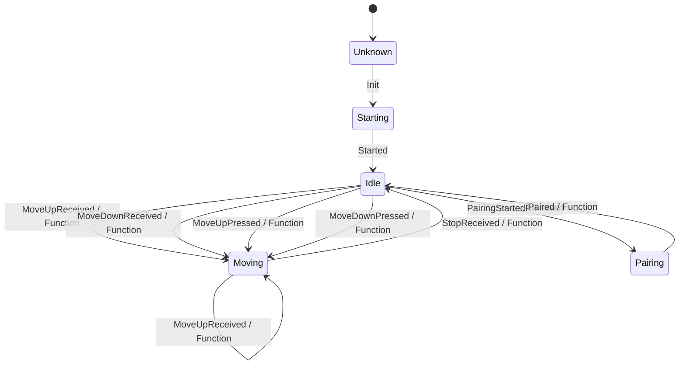

# schellenberg-usb

Control Schellenberg devices using the RF stick. UI is only a REST api which easily can be integrated in any third part system (eg: Home Assistant).
Project is still under development.

## Docker for RaspberryPI

https://hub.docker.com/repository/docker/atilladocker/schellenberg-web2rf-api


## State Machine definition overview 



## Copy docker-compose.yaml file to server using ssh:

```batch 
scp -O .\docker-compose.yaml root@homeassistant.local:/home/schellenberg-service/
```

# Linux Versionen

Auf dem Raspberry PI 4 mit home assistant ist folgende Linux distribution istalliert:
```
NAME="Alpine Linux"
ID=alpine
VERSION_ID=3.21.0
PRETTY_NAME="Alpine Linux v3.21"
HOME_URL="https://alpinelinux.org/"
BUG_REPORT_URL="https://gitlab.alpinelinux.org/alpine/aports/-/issues"
```

# USB driver challenge under linux

Check detailed USB info:

```
lsusb

or

sudo usb-devices | grep -A 5 "16c0"
```

In the response you can see the loaded driver. We had the CDC device with VID/PID 16c0:05e1 attached. For this type of device, the Linux kernel typically loads the 'cdc_acm' driver automatically, which is likely causing "Resource busy" error. If the cdc_acm driver is definitely attached to your device on your interfaces try a aggressive approach to prevent cdc_acm from claiming the device:

Create a blacklist file to prevent cdc_acm from loading at all:

```
sudo nano /etc/modprobe.d/blacklist-cdc-acm.conf
```

Add this line as file content:
```
blacklist cdc_acm
```

Then reload modules:
```
sudo update-initramfs -u
sudo reboot
```