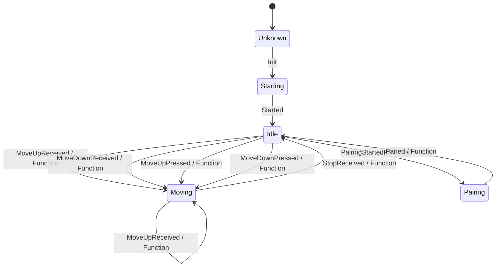

# schellenberg-usb

## State Machine definition overview 

```mermaid
stateDiagram-v2
	Unknown --> Starting : Init
	Starting --> Idle : Started
	Idle --> Moving : MoveUpReceived / Function
	Idle --> Moving : MoveDownReceived / Function
	Idle --> Moving : MoveUpPressed / Function
	Idle --> Moving : MoveDownPressed / Function
	Idle --> Pairing : PairingStartedReceived
	Moving --> Idle : StopReceived / Function
	Moving --> Moving : MoveDownPressed / Function
	Moving --> Moving : MoveDownReceived / Function
	Moving --> Moving : MoveUpPressed / Function
	Moving --> Moving : MoveUpReceived / Function
	Pairing --> Idle : Paired / Function
    [*] --> Unknown
```