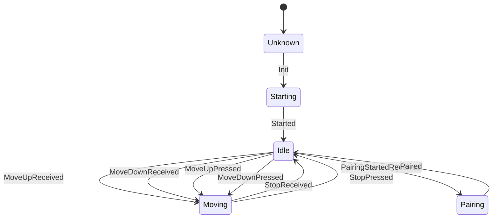

# schellenberg-usb

```mermaid
stateDiagram-v2
	Unknown --> Starting : Init
	Starting --> Idle : Started
	Idle --> Moving : MoveUpReceived
	Idle --> Moving : MoveDownReceived
	Idle --> Moving : MoveUpPressed
	Idle --> Moving : MoveDownPressed
	Idle --> Pairing : PairingStartedReceived
	Moving --> Idle : StopReceived
	Moving --> Idle : StopPressed
	Pairing --> Idle : Paired
[*] --> Unknown
```