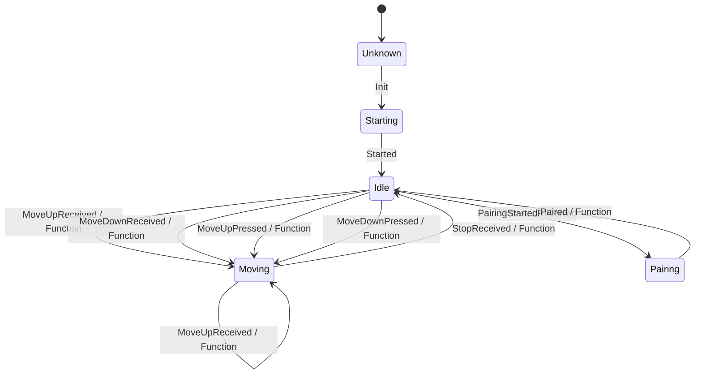

# schellenberg-usb

Control Schellenberg devices using the RF stick. UI is only a REST api which easily can be integrated in any third part system (eg: Home Assistant).
Project is still under development.

## Docker for RaspberryPI

https://hub.docker.com/repository/docker/atilladocker/schellenberg-web2rf-api


## State Machine definition overview 



## Copy docker-compose.yaml file to server using ssh:

```batch 
scp -O .\docker-compose.yaml root@homeassistant.local:/home/schellenberg-service/
```

# Linux Versionen

Auf dem Raspberry PI 4 mit home assistant ist folgende Linux distribution istalliert:
```
NAME="Alpine Linux"
ID=alpine
VERSION_ID=3.21.0
PRETTY_NAME="Alpine Linux v3.21"
HOME_URL="https://alpinelinux.org/"
BUG_REPORT_URL="https://gitlab.alpinelinux.org/alpine/aports/-/issues"
```